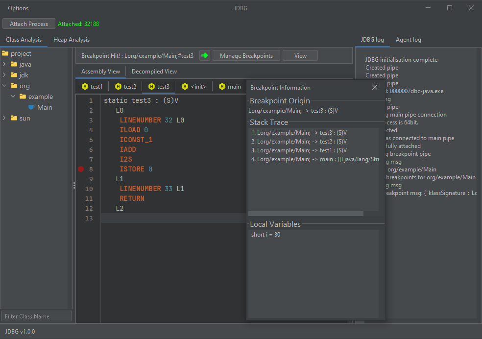
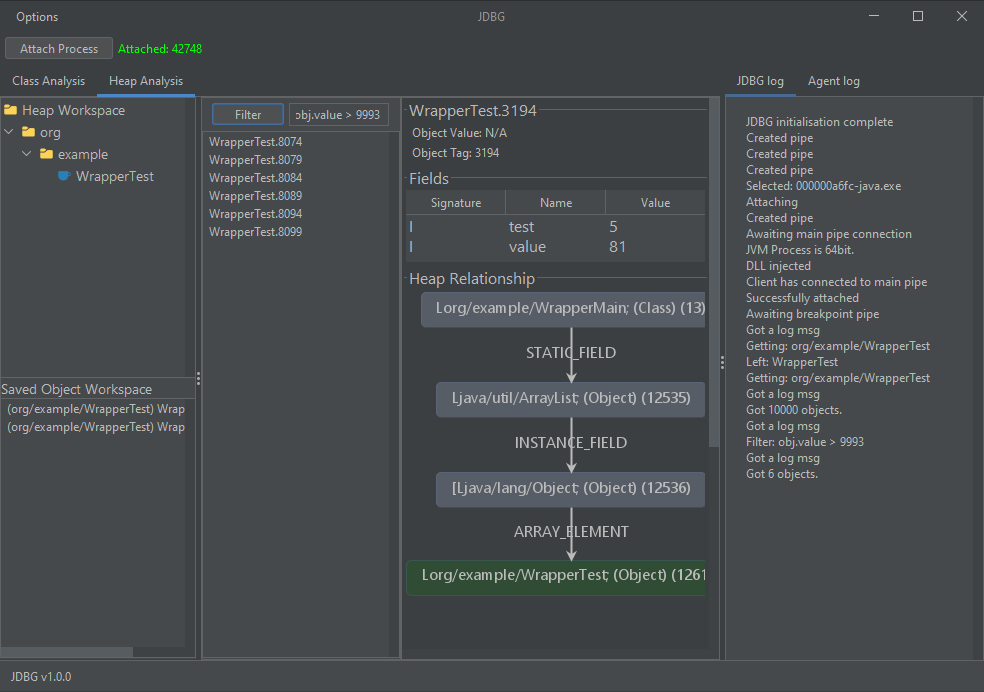

# JDBG

    

JDBG is a powerful runtime Java debugger that leverages an injected DLL along with JNI and JVMTI to provide deep insight into Java applications.

## Features
- Class Analysis
  - Analyse decompiled classes at runtime
  - Analyse method bytecode and field definitions at runtime
  - Add classes to object analysis
  - Dynamically set breakpoints in bytecode
     - Inspect the stack trace
     - Inspect local variable values
  - Planned Features
     - bytecode instrumentation and class redefinitions
     - static variable modification
     - Static field watching
     - Local variable modification for breakpoints
     - Add object from stack in breakpoint to object analysis
- Object Analysis
  - Add classes to object workspace
  - View all instances of a class
  - Apply filters using the Exprtk C++ library to obtain relevant objects
     - Filters support recursive searches, e.g. obj.field1.field2 > 3 or 'hello' in obj.field1
     - Planned support for arrays
  - Observe object values (such as strings) and fields
  - Generate graphs based on the heap relationships of objects
     - Obtain pointer paths to specific objects, useful in determining classes from which they originate (especially for strings)
  - Planned features
     - Set field values

## How to use

To use JDBG, you must have a JVM running Java 17 or higher.

### Releases

You can download and run it in the releases tab of this project.

### Building it yourself

The java client is built in Intellij while the dll is built in Visual Studio

To build the dll, you must add the /includes of your jdk to the include path (For things like jni.h and jvmti.h)
You must also have the boost library for C++ installed.

You must add the dll to the /assets folder of the client
Furthermore, you must build the JDBG 32bit Helper executable and add it to the assets folder of the client.
- The reason for this is that we are unable to get the proper base address of kernel32.dll and LoadLibrary for 32 bit applicatons from 64bit in usermode.

### Contributing

any and all contributions to this project would be greatly appreciated.
Some examples of possible contributions include:
   - Cleaning up messy code
   - Adding comments
   - Implementing design patterns for cleaner code
   - Feature implementations (Such as the planned ones above)

Thank you

### Licensing

This project is licensed under the Apache-2.0 License. Furthermore, JDBG is intended only for educational and legal research purposes. It must not be used to circumvent copy protection, license verification, or other security mechanisms. The author is not responsible for any misuse of this tool. Users must comply with all applicable laws.

